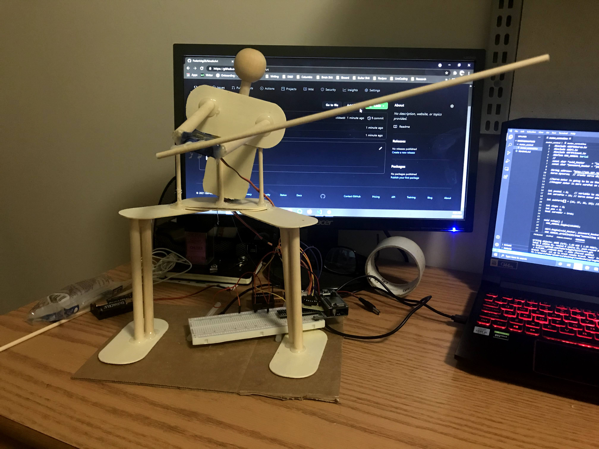
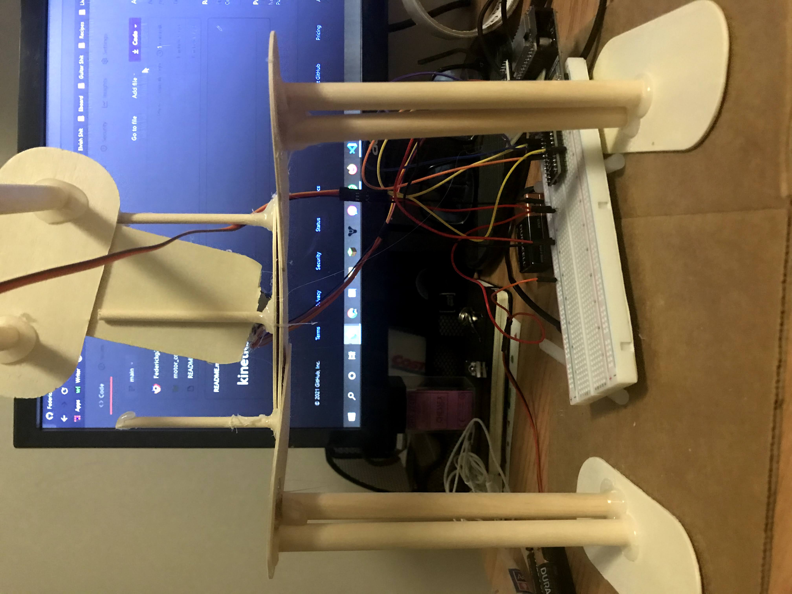
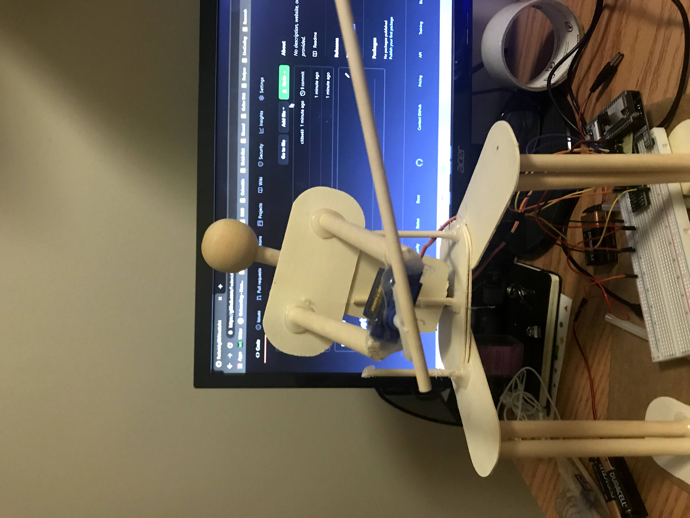

# Cudgel Pointing 

This repository contains arduino code that is used to activate a servo motor and a stepper motor that activates a kinetic sculpture of a man performing a basic Cudgel Pointing (or alternatively, staff tap) exercise. To make this code work, you need an EPS32 wrover module, along with a stepper motor and a server motor, and a sculpture. 

[Video Demo](https://youtu.be/IrZrdQf3TE8)

# Table of Contents <!-- omit in toc -->
- [Setup](#setup)
  - [Hardware](#hardware)
  - [Software](#software)
  - [Sculpture](#sculpture)
  - [Getting Started](#running)  

# Setup

## Hardware

This program is rather simple. It requires an esp32 wrover module with an attached stepper motor and an attached micro server motor, along with external power supplies. 

1. Servo motor
    * Connect the Signal input to pin 15
    * Connect the VCC pin to an external power supply (here, I used a pair of AA batteries).
    * Connect the GND pin to the GND extension of the ESP32 Extension Board. 
2. Stepper motor
    * Connect the VCC pin to the 5V extension of the ESP32 GPIO Extension Board.
    * Connect the GND pin to the GND extension of the ESP32 Extension Board. 
    * Connect IN1 to pin 14
    * Connect IN2 to pin 27
    * Connect IN3 to pin 26
    * Connect IN4 to pin 25
3. AA Batteries
    * Connect power output to the servo motor
    * Connect the GND pin to the GND extension of the ESP32 Extension Board. 
4. 9v battery
    * Connect to the 9v battery port on the ESP32 GPIO Extension Board.

## Software 

The Arduino code, which is to be run on the esp32. It is contained within the motor_control folder. It begins by setting up a connection to a wifi server, and then accessing the site contained at `http://165.227.76.232:3000/`, allowing the motors to access the API which determines whether or not the button should be pressed, i.e. whether or not the sculpture should be active. If an active response is recieved, the program begins moving the servo and stepper motor. If the server motor is increasing, and therefore rotating towards the right, then the stepper motor will do the same. When the servo motor reaches either extreme, it flips directions, and so does the stepper motor, allowing the figure to pivot at both the waist and the wrists in the same direction.

## Sculpture 

As a member of Columbia Wushu since my Freshman year of college, I've discovered that one of my favorite forms is the staff form. I really enjoy my staff, it's even visible in my Zoom profile picture. Therefore, when I was offered a project where I could use 2 motors, I thought quickly of a certain move in the staff form where the athlete performs taps on the ground, which can be seen [right here](https://youtu.be/QWOEkQmBUhg?t=26) (though I must warn of bad quality). 
The figure here is made of a few different sized dowels serving as supports, arms and legs, and a few flat pieces of wood serving as feet, a torso, and thighs. A lot of hot glue was made to put this together, gluing the stepper motor to the torso in order to allow motion at the "hips", and gluing the servo to the arms so that there could be "wrist" motion. 

## Getting Started

First, you must load the motor_control script onto the esp32 module. This can be done by opening the Arduino program, compiling and uploading the code to the arduino, and being sure to hold down the boot button while this is occuring. Before anything else happens, you must change `const char* sid ` and `const char* password` in motor_control.ino to match whatever WiFi network your esp32 will be connected to. Make sure that the servo and stepper motor are properly plugged in, following the instructions contained above. Then place the figure somewhere, plug in the power sources, and open the site at [this link](http://165.227.76.232:3000/fag2113). Once the site is loaded, click the button and watch the figure start moving! He'll move slowly and unsure of himself, as he is still a beginner, but with time I'm sure he'll improve. 